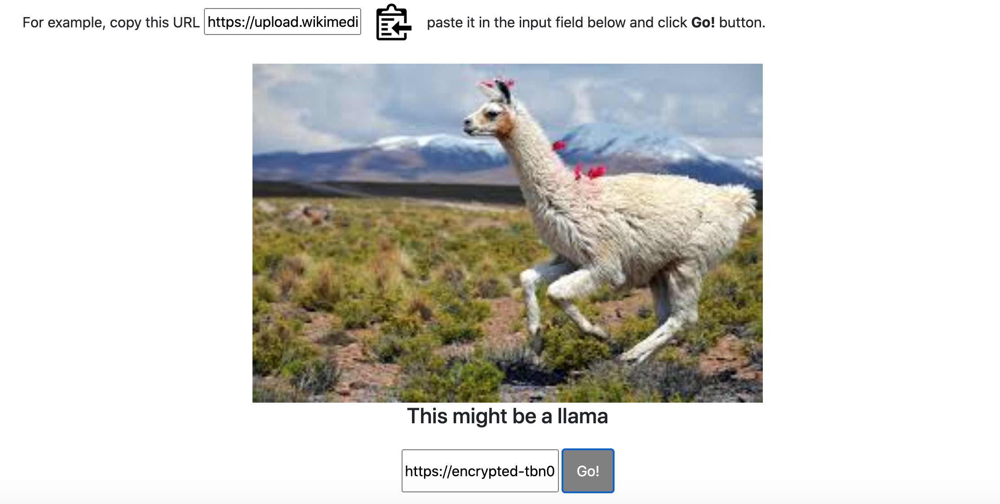
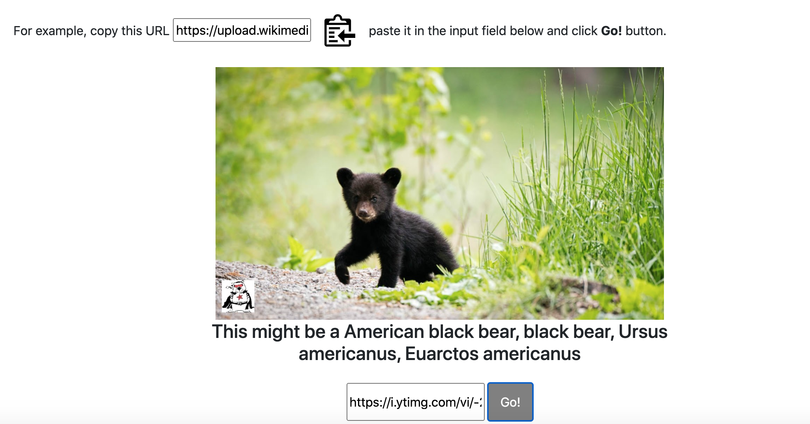
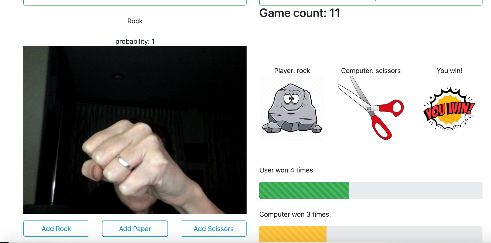

# Machine Learning and Gaming with TensorFlow.js

Machine Learning and Games project implements idea of how we can use ML in gaming and education. It has an image classifier model to recognize images of 1000 classes. Second model can learn from user and will be used to play against computer Rock Paper Scissors game.

1. TensorFlow.js

This library allows you to harness huge power of neural nets models that are already build using TensorFlow or Keras, making your JS application look almost like magic. You are also able to create models from scratch with new JavaScript API and train them using client’s GPU processing power.

Thank you : https://github.com/tensorflow/tfjs-models/tree/master/mobilenet

2. MobileNet

Let's first take a look at an off-the-shelf MobileNet, a model that is trained on ImageNet a dataset of millions of images with labels for 1000 different classes of objects, like dogs, cats, and fruits.

The pre-trained models we provide are trained to recognize 1000 classes of image. For a full list of classes, see the labels file in the model zip.

3. Transfer learning
   This technique starts with an already trained model and specializes it for the task at hand. This lets you train far more quickly and with less data than if you were to train from scratch.

You can use a technique known as transfer learning to re-train a model to recognize classes not in the original set. For example, you could re-train the model to distinguish between different species of tree, despite there being no trees in the original training data. To do this, you will need a set of training images for each of the new labels you wish to train.

In this case, we'll bootstrap our model from a pre-trained model called MobileNet. Our system will learn to make predictions using our own classes that were never seen by MobileNet.

The retraining is so effective that we don't have to have to do anything fancy like train another neural network, but instead we just use a nearest neighbors approach. What we do is feed an image through MobileNet and find other examples in the dataset that have similar activations to this image. In practice, this is noisy, so instead we choose the kk nearest neighbors and choose the class with the most representation.

By bootstrapping our model with MobileNet and using kk nearest neighbors, we can train a realistic classifier in a short amount of time, with very little data, all in the browser. Doing this fully end-to-end, from pixels to prediction, would require too much time and data for an interactive application.

Thank you : https://codelabs.developers.google.com/codelabs/tensorflowjs-teachablemachine-codelab/index.html#2

4. A modern approach to copy text to clipboard
   https://clipboardjs.com/
